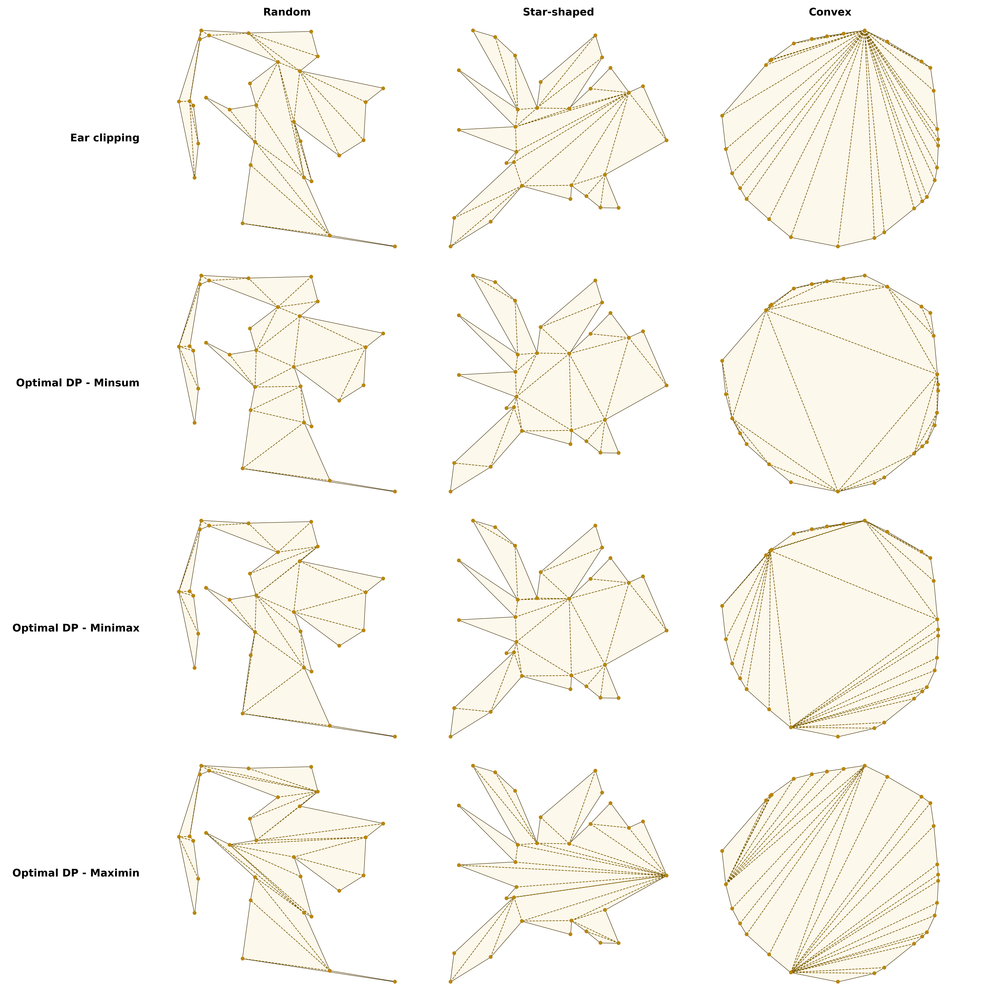

# Optimal Polygon Triangulation via Dynamic Programming

Computes optimal triangulations of simple polygons using interval dynamic programming, with
experimental comparison against the ear clipping baseline.

---

## Background

A triangulation of an $n$-vertex simple polygon partitions it into $n-2$ triangles using
exactly $n-3$ non-crossing internal diagonals. Since every valid triangulation uses the same
number of diagonals, algorithms differ only in which diagonals are chosen.

---

## Algorithm

Let $\text{cost}[i][j]$ denote the optimal cost to triangulate the sub-polygon spanning
vertices $i$ through $j$. The recurrence is:

$$\text{cost}[i][j] = \min_{\substack{c=i+1 \\ (i,c),\,(c,j)\text{ valid}}}^{j-1}
\bigl(\text{cost}[i][c] + \text{cost}[c][j] + w(i,c,j)\bigr)$$

A split table records the optimal $c$ at each interval for backtracking.

**Complexity:** Time $O(n^3)$ · Space $O(n^2)$

Three cost functions $w$ are supported:

| Criterion | Optimises                      |
|-----------|--------------------------------|
| `minsum`  | Minimize $\sum_d \|d\|$        |
| `minimax` | Minimize $\max_d \|d\|$        |
| `maximin` | Maximize $\min_d \|d\|$        |

### Chain-Breaking Optimisation

When processing sub-arc $(i, j)$, the polygon linked list is temporarily broken at the verified
diagonal $v_i v_j$. Child calls to `check_valid_diagonal` then traverse only the sub-arc
($O(k)$ edges) rather than the full polygon ($O(n)$ edges). This does not change the asymptotic
bound but gives a substantial practical speedup for non-convex polygons.

Full pseudocode is in [`PSEUDOCODE.md`](PSEUDOCODE.md).

---

## Results

Metrics are normalized by the mean polygon edge length $\bar{e}$. Results are mean $\pm$ std
over the full test suite (convex, star-shaped, and random simple polygons, $n = 5$ to $100$,
in steps of 5, with 20 instances per size). Ear clipping is included as a baseline.

| Algorithm         | $\bar{d}/\bar{e}$ | $d_{\max}/\bar{e}$ | $d_{\min}/\bar{e}$ |
|-------------------|:-----------------:|:------------------:|:------------------:|
| Ear Clipping      | 4.58 ± 5.73       | 7.65 ± 8.38        | 0.68 ± 0.74        |
| Optimal `minsum`  | 1.78 ± 1.35       | 6.33 ± 7.82        | 0.33 ± 0.29        |
| Optimal `minimax` | 3.28 ± 3.96       | 5.98 ± 7.17        | 0.58 ± 0.60        |
| Optimal `maximin` | 5.03 ± 5.95       | 8.20 ± 8.05        | 1.53 ± 1.77        |

- $\bar{d}/\bar{e}$ — mean diagonal length / mean edge length
- $d_{\max}/\bar{e}$ — longest diagonal / mean edge length
- $d_{\min}/\bar{e}$ — shortest diagonal / mean edge length

Each DP criterion achieves optimality on its own metric by construction. `minsum` also produces
the smallest mean diagonal length overall. `maximin` maximises $d_{\min}/\bar{e}$ at the cost
of a larger mean. Detailed breakdown by polygon type is in `results/comparison_by_type.csv`.



---

## Repository Structure

```
.
├── src
│   ├── ear_clipping
│   │   ├── __init__.py
│   │   ├── __main__.py        # CLI entry point
│   │   └── algorithm.py       # Ear clipping triangulation (O'Rourke)
│   ├── optimal
│   │   ├── __init__.py
│   │   ├── __main__.py        # CLI entry point
│   │   ├── algorithm.py       # Interval DP triangulation
│   │   ├── cost.py            # Cost functions (minsum, minimax, maximin)
│   │   └── tracer.py          # Optional DP execution tracer
│   ├── models
│   │   ├── __init__.py
│   │   ├── point.py           # Point
│   │   └── polygon.py         # Polygon, PolygonVertex
│   └── utils
│       ├── __init__.py
│       ├── geometry.py        # Orientation, intersection, diagonal validity
│       ├── io.py              # Polygon file reader
│       ├── validation.py      # Input and triangulation validation
│       └── visualization.py   # Matplotlib polygon visualizer
├── scripts
│   ├── generate_testing_suite.py
│   └── run_analysis.py
├── assets/
├── sample_input/
├── app.py                     # Gradio interactive app
├── pyproject.toml
├── PSEUDOCODE.md
├── README.md
└── USAGE.md
```

---
## References

- O'Rourke, J. (1994). *Computational Geometry in C* (1st ed.). Cambridge University Press.
- Auer, T., & Held, M. (1996). Heuristics for the generation of random polygons.
  *Proc. 8th Canadian Conference on Computational Geometry (CCCG'96)*, pp. 38–43.

---

See [`USAGE.md`](USAGE.md) for setup, CLI commands, and analysis instructions.
